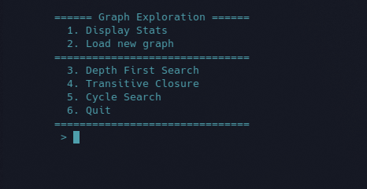
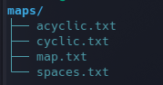

# Java Graph Exploration
Author: Nicholas O'Kelley

## Motivation
The motivation was to allow further research in graph theory as applied in
Computer Science while also using an Object Oriented Language to achieve my goals.
Most of the algorithms were learned from books, general lectures
and/or just reading the wiki pages and watching some videos.
               
This program allows the user to load in a text file representing a graph 
and perform various graph seraches and analysis processes.     
The user can also, choose to load a different text file and the program will display all files in the 
map directory. Thus, allowing the user to select different files in a single 
program execution.
                 

## Prerequisites
In order to experience the **Graph Exploration**, you will need to ensure
the following dependencies are installed.

1. Clone this repo: 
```bash
git clone https://github.com/OkelleyDevelopment/Graph-Exploration.git
```
       
2. The Java SDK/JDK
## Program Compilation and Execution
NOTE: Run the following commands in the Project root directory
               
1. To Compile:
```bash
javac -d classes/ src/*.java 
```
2. To Run the program, run the following command:
```bash
cd src/
           
java -cp classes/ Driver maps/<text file from maps> 
```

## Graphs/ Maps



## Known issues:
* Need to make the Vertex list have a header and appropriate spacing.
* Might be a couple uncaught exceptions, but will be patched as they are found
* Clearing the screen wasnt working and needs to be looked at in the future

## Future Goals:
I hope to add in more algorithms that handle graphs such as:
* Dijkstra's Shortest Path Algorithm
* Breadth First Search
* A*
* A functioning clear screen method
